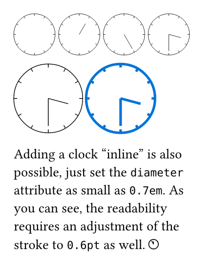

# clocks - clock faces for Typst!


A small package for creating clock faces. 

Great for helping children learn to read the clock.

## Features
- clock faces without hands
- clock faces with a hour hand or hour and minute hands
- custom diameter
- custom strokes possible
- no further dependencies

## Getting started

```typst
#import "@preview/clocks:1.0.0"

// You can draw "empty" clock faces
#clocks.clock()
// Clock with hour hand only.
#clocks.clock(hours: 1)
// Clock with minute hand only.
#clocks.clock(minutes: 30)
// Clock with hour and minute hands.
#clocks.clock(hours: 3, minutes: 30)
// You may adjust the default diameter of 3em.
#clocks.clock(diameter: 5em, hours: 3, minutes: 30)
// And you may adjust the stroke.
#clocks.clock(diameter: 5em, hours: 3, minutes: 30, stroke: (thickness: 2pt, cap: "round", paint: blue))

Adding a clock "inline" is also possible, just set the `diameter` attribute as small as `0.7em`. As you can see, the readability requires an adjustment of the stroke to `0.6pt` as well. #clocks.clock(diameter: 0.7em, hours: 11, minutes: 55, stroke: (0.6pt))
```



## API Reference

- **clock**`(diameter: 3em, hours: none, minutes: none, stroke: none)`\
`diameter` is *optional*, defaults to a diameter of `3em`.\
`hours` is *optional*, number from 1 to 12. Hour hand is not drawn if not provided.\
`minutes` is *optional*, number from 1 to 60. Minute hand is not drawn if not provided.\
`stroke` is *optional*, defaults to a thickness of `1%` of the diameter. You may pass a [Typst stroke](https://typst.app/docs/reference/visualize/stroke/) object.\

## Contributing
Please visit the [GitHub repository](https://github.com/florianb/typst-clocks) to fork the package or leave an issue. :D
